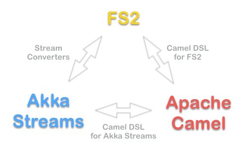

Streamz
=======

Streamz provides combinator libraries for integrating [Functional Streams for Scala](https://github.com/functional-streams-for-scala/fs2) (FS2), [Akka Streams](http://doc.akka.io/docs/akka/2.4/scala/stream/index.html) and [Apache Camel endpoints](http://camel.apache.org/components.html). They integrate

- **Apache Camel with Akka Streams:** Camel endpoints can be integrated into Akka Stream applications with the [Camel DSL for Akka Streams](streamz-camel-akka/README.md).
- **Apache Camel with FS2:** Camel endpoints can be integrated into FS2 applications with the [Camel DSL for FS2](streamz-camel-fs2/README.md).
- **Akka Streams with FS2:** Akka Stream `Source`s, `Flow`s and `Sink`s can be converted to FS2 `Stream`s, `Pipe`s and `Sink`s, respectively, and vice versa with [Stream converters](streamz-converter/README.md).

Dependencies
------------

Streamz artifacts are available for Scala 2.11 and 2.12 at:

    resolvers += "krasserm at bintray" at "http://dl.bintray.com/krasserm/maven"

### Latest stable release for FS2 0.10

    libraryDependencies += "com.github.krasserm" %% "streamz-camel-akka" % "0.9"

    libraryDependencies += "com.github.krasserm" %% "streamz-camel-fs2" % "0.9" // uses FS2 0.10.1

    libraryDependencies += "com.github.krasserm" %% "streamz-converter" % "0.9" // uses FS2 0.10.1

### Latest stable release for FS2 0.9

    libraryDependencies += "com.github.krasserm" %% "streamz-camel-akka" % "0.8.1"

    libraryDependencies += "com.github.krasserm" %% "streamz-camel-fs2" % "0.8.1" // uses FS2 0.9.5

    libraryDependencies += "com.github.krasserm" %% "streamz-converter" % "0.8.1" // uses FS2 0.9.5

Documentation
-------------

### Streamz 0.9

- [Camel DSL for Akka Streams](streamz-camel-akka/README.md)
- [Camel DSL for FS2](streamz-camel-fs2/README.md)
- [Stream converters](streamz-converter/README.md)
- [Example application](streamz-examples/README.md)

### Streamz 0.8.1

- [Camel DSL for Akka Streams](https://github.com/krasserm/streamz/blob/v-0.8.1/streamz-camel-akka/README.md)
- [Camel DSL for FS2](https://github.com/krasserm/streamz/blob/v-0.8.1/streamz-camel-fs2/README.md)
- [Stream converters](https://github.com/krasserm/streamz/blob/v-0.8.1/streamz-converter/README.md)
- [Example application](https://github.com/krasserm/streamz/blob/v-0.8.1/streamz-examples/README.md)

API docs
--------

### Streamz 0.9

Not published yet. Run `sbt unidoc` on branch `r-0.9` or `master` for generating 0.9 API docs. 

### Streamz 0.8.1

- [API docs for Scala 2.12](http://krasserm.github.io/streamz/scala-2.12/unidoc/index.html)
- [API docs for Scala 2.11](http://krasserm.github.io/streamz/scala-2.11/unidoc/index.html)

External examples
-----------------

- [Serve static files from an FS2 stream in an Akka HTTP server](https://gist.github.com/bmc/2db513245a4d7213ba7aba4f67723d12).
