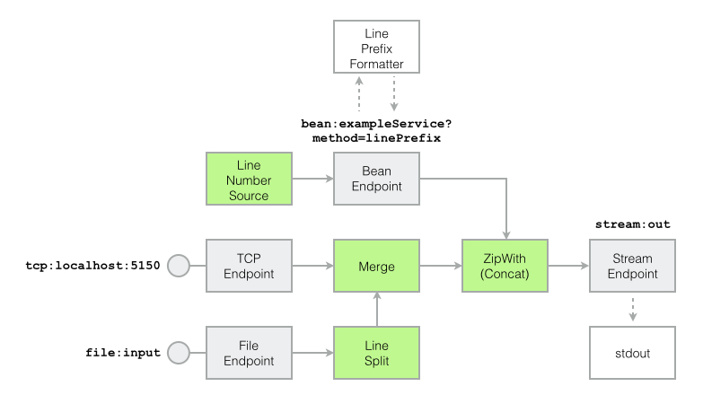

Example application
-------------------

The example application consumes file content line by line, either from a TCP endpoint or a from file endpoint, and prints the consumed lines prefixed with a formatted line number to `stdout`:



- The TCP endpoint is implemented with the [Netty4 component](http://camel.apache.org/netty4.html). It listens on `localhost:5051` and is configured to use a text line codec (see `tcpEndpointUri` below) so that consumers receive a separate message for each line.
- The file endpoint is implemented with the [File component](http://camel.apache.org/file2.html). It scans the `input` directory for new files and serves them as `String`s to consumers. The consumed file content is split into lines in a separate *Line Split* step.
- Lines consumed from both endpoints are merged into a single stream in a *Merge* step.
- To generate line numbers for the consumed lines, a *Line Number Source* is configured to generate numbers 1, 2, ..., n. These numbers are then formatted to a line prefix using the `[$lineNumber] ` template. The line number formatter is an object registered in the `CamelContext` under the name `exampleService` and accessed with a [Bean endpoint](https://camel.apache.org/bean.html) configured to call the `linePrefix` method.
- The line prefixes are then concatenated with the actual lines in a *ZipWith* step.
- Finally, the concatenation results are sent to `stream:out`, a [Stream endpoint](http://camel.apache.org/stream.html) that writes messages to `stdout`.

The following subsections show implementations of the example application with

- the [Camel Java DSL for Akka Streams](#example-akka-java)
- the [Camel Scala DSL for Akka Streams](#example-akka-scala) and 
- the [Camel DSL for FS2](#example-fs2)

The source code is available in the [streamz-examples](https://github.com/krasserm/streamz/tree/master/streamz-examples) module. Section [Example application usage](#example-usage) shows how to run and use the example application.

<a name="example-akka-java"></a>
### Camel Java DSL for Akka Streams

```java
import akka.NotUsed;
import akka.actor.ActorSystem;
import akka.stream.ActorMaterializer;
import akka.stream.javadsl.Sink;
import akka.stream.javadsl.Source;
import org.apache.camel.impl.DefaultCamelContext;
import org.apache.camel.impl.SimpleRegistry;
import streamz.camel.StreamContext;
import streamz.camel.akka.javadsl.JavaDsl;

import static java.util.Arrays.asList;

public class JExampleService {
    public String linePrefix(int lineNumber) {
        return String.format("[%d] ", lineNumber);
    }
}

public class JExampleContext implements JavaDsl {
    public static String tcpEndpointUri =
            "netty4:tcp://localhost:5150?sync=false&textline=true&encoding=utf-8";

    public static String fileEndpointUri =
            "file:input?charset=utf-8";

    public static String serviceEndpointUri =
            "bean:exampleService?method=linePrefix";

    public static String printerEndpointUri =
            "stream:out";

    private StreamContext streamContext;

    public JExampleContext() throws Exception {
        SimpleRegistry camelRegistry = new SimpleRegistry();
        DefaultCamelContext camelContext = new DefaultCamelContext();

        camelRegistry.put("exampleService", new JExampleService());
        camelContext.setRegistry(camelRegistry);
        camelContext.start();

        streamContext = StreamContext.create(camelContext);
    }

    @Override
    public StreamContext streamContext() {
        return streamContext;
    }
}

public class JExample extends JExampleContext {
    private ActorMaterializer actorMaterializer;

    public JExample() throws Exception {
        super();
        ActorSystem actorSystem = ActorSystem.create("example");
        actorMaterializer = ActorMaterializer.create(actorSystem);
    }

    public Runnable setup() {
        Source<String, NotUsed> tcpLineSource =
                receiveBody(tcpEndpointUri, String.class);

        Source<String, NotUsed> fileLineSource =
                receiveBody(fileEndpointUri, String.class).mapConcat(s -> asList(s.split("\\r\\n|\\n|\\r")));

        Source<String, NotUsed> linePrefixSource =
                Source.range(1, Integer.MAX_VALUE).via(sendRequestBody(serviceEndpointUri, String.class));

        Source<String, NotUsed> stream =
                tcpLineSource
                        .merge(fileLineSource)
                        .zipWith(linePrefixSource, (l, n) -> n.concat(l))
                        .via(sendBody(printerEndpointUri));

        return () -> { stream.runWith(Sink.ignore(), actorMaterializer); };
    }

    public static void main(String... args) throws Exception {
        new JExample().setup().run();
    }
}
```

<a name="example-akka-scala"></a>
### Camel Scala DSL for Akka Streams

```scala

import akka.NotUsed
import akka.actor.ActorSystem
import akka.stream.ActorMaterializer
import akka.stream.scaladsl._

import streamz.camel.StreamContext
import streamz.camel.akka.scaladsl._

import org.apache.camel.impl.{ DefaultCamelContext, SimpleRegistry }

import scala.collection.immutable.Iterable

class ExampleService {
  def linePrefix(lineNumber: Int): String = s"[$lineNumber] "
}

trait ExampleContext {
  private val camelRegistry = new SimpleRegistry
  private val camelContext = new DefaultCamelContext

  camelContext.start()
  camelContext.setRegistry(camelRegistry)
  camelRegistry.put("exampleService", new ExampleService)

  implicit val context: StreamContext =
    StreamContext(camelContext)

  val tcpEndpointUri: String =
    "netty4:tcp://localhost:5150?sync=false&textline=true&encoding=utf-8"

  val fileEndpointUri: String =
    "file:input?charset=utf-8"

  val serviceEndpointUri: String =
    "bean:exampleService?method=linePrefix"

  val printerEndpointUri: String =
    "stream:out"
}

object Example extends ExampleContext with App {
  implicit val system = ActorSystem("example")
  implicit val materializer = ActorMaterializer()

  val tcpLineSource: Source[String, NotUsed] =
    receiveBody[String](tcpEndpointUri)

  val fileLineSource: Source[String, NotUsed] =
    receiveBody[String](fileEndpointUri).mapConcat(_.lines.to[Iterable])

  val linePrefixSource: Source[String, NotUsed] =
    Source.fromIterator(() => Iterator.from(1)).sendRequest[String](serviceEndpointUri)

  val stream: Source[String, NotUsed] =
    tcpLineSource
      .merge(fileLineSource)
      .zipWith(linePrefixSource)((l, n) => n concat l)
      .send(printerEndpointUri)

  stream.runWith(Sink.ignore)
}
```

<a name="example-fs2"></a>
### Camel DSL for FS2

Here, we re-use `ExampleService` and `ExampleContext` from the previous section.

```scala
import cats.effect.IO
import fs2.{ Stream, text }

import streamz.camel.fs2.dsl._
import streamz.examples.camel.ExampleContext

object Example extends ExampleContext with App {
  import scala.concurrent.ExecutionContext.Implicits.global // needed for merge

  val tcpLineStream: Stream[IO, String] =
    receiveBody[IO, String](tcpEndpointUri)

  val fileLineStream: Stream[IO, String] =
    receiveBody[IO, String](fileEndpointUri).through(text.lines)

  val linePrefixStream: Stream[IO, String] =
    Stream.iterate(1)(_ + 1).sendRequest[String](serviceEndpointUri)

  val stream: Stream[IO, String] =
    tcpLineStream
      .merge(fileLineStream)
      .zipWith(linePrefixStream)((l, n) => n concat l)
      .send(printerEndpointUri)

  stream.compile.drain.unsafeRunSync()
}
```

<a name="example-usage"></a>
### Example application usage

For running the example application you first need to checkout the project: 

```
$ git clone https://github.com/krasserm/streamz.git
```

From the project’s root directory, the example application can be started with one of the following commands (depending on the implementation):

```
$ sbt 'examples/runMain streamz.examples.camel.akka.JExample'
$ sbt 'examples/runMain streamz.examples.camel.akka.Example'
$ sbt 'examples/runMain streamz.examples.camel.fs2.Example'
```

Before submitting data to the application, create an input file with two lines:

```
$ cat >> example.txt
hello
streamz
^D
```

Copy the generated file to the `input` directory so that it can be consumed by the file endpoint:

```
$ cp example.txt input/
```

You should see the following stream output:

```
[1] hello
[2] streamz
```

Then send the file content to the TCP endpoint (with `nc` on Mac OS X or `netcat` on Linux):

```
$ cat example.txt | nc localhost 5150
```

You should see the following stream output:

```
[3] hello
[4] streamz
```
